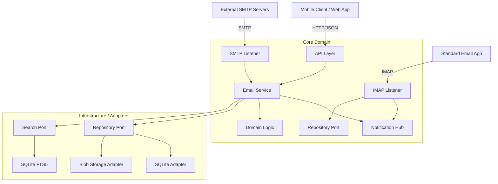

# MailRaven Architecture Documentation

MailRaven is a modern, modular email server designed with a "Mobile-First" philosophy. Unlike traditional mail servers that primarily serve IMAP/POP3 clients, MailRaven exposes a rich RESTful JSON API optimized for mobile devices, enabling features like delta sync, push notifications (future), and server-side search.

## High-Level Overview

MailRaven follows the **Ports and Adapters (Hexagonal)** architecture. 

## Layers

### 1. Interface Layer (Primary Adapters)
- **SMTP Listener**: Listens on port 25/587. Handles the SMTP protocol state machine (RFC 5321).
  - Implementation: `internal/adapters/smtp`
- **IMAP Listener**: Listens on port 143/993. Handles RFC 3501 (Client Access).
  - Implementation: `internal/adapters/imap`
  - Supports: core commands and `IDLE` (Push).
- **HTTP API**: Exposes endpoints for email retrieval, sending, domain management, and system stats.
  - Implementation: `internal/adapters/http`
  - Authentication: JWT-based.
  - **Security Endpoints**: Serves `.well-known/mta-sts.txt` and receives TLS Reports via `.well-known/tlsrpt`.
- **Web Portal**: React-based SPA serving both Admin Dashboard and User Webmail.
  - Implementation: `client/` (served via `internal/adapters/http`)

### 2. Core Layer (Business Logic)
- **Services**: Orchestrate the flow of data.
  - `EmailService`: Handles receiving emails, validating them (SPF/DKIM/DMARC), and storing them.
  - `OutboundService`: Manages the sending queue and delivery to remote servers with **DANE** verification support.
  - `NotificationHub`: Global event bus for Real-time updates (IMAP IDLE).
- **Domain Security**:
  - `MTASTSPolicy`: Logic for generating and serving Strict Transport Security policies.
  - `DANEValidator`: DNSSEC-based validator for verifying remote SMTP servers.
- **Ports**: Interfaces defining how the core interacts with the outside world (e.g., `EmailRepository`, `BlobStore`).
- **Domain**: Pure Go structs representing `Email`, `User`, `Thread`.

### 3. Infrastructure Layer (Secondary Adapters)
- **Storage**:
  - **Metadata**: Stored in SQLite (embedded) OR PostgreSQL (production scale).
  - **Blobs (Email Bodies)**: Stored in the filesystem, gzip compressed, partitioned by date (`YYYY/MM/DD`).
- **Search**:
  - **SQLite**: FTS5 extension.
  - **PostgreSQL**: TSVECTOR full-text search.
  - Indexes headers, body snippets, and recipients.

## Key Decisions

- **Why JSON API and not IMAP?**
  IMAP is chatty and hard to optimize for battery-constrained mobile devices. A JSON API allows for batching, partial updates, and simplified parsing on the client side.
- **Why SQLite?**
  For a self-hosted single-tenant or small multi-tenant server, SQLite provides excellent performance, zero operational overhead, and easy backups (just copy the file).
- **Blob Storage Separation**:
  Keeping binary email content out of the database keeps the index small and fast. Atomic writes to the filesystem ensure data integrity.

## Directory Structure

- `client/`: React Frontend (Web Admin & Webmail).
- `cmd/`: Entry points (main application).
- `internal/`: Private application code.
  - `core/`: Domain logic and interfaces.
  - `adapters/`: Implementations (HTTP, SMTP, SQLite).
- `deployment/`: Configuration and systemd files.
- `specs/`: Planning and design documents.
- `mox/`: (Reference) The Mox codebase used for comparison and inspiration.
