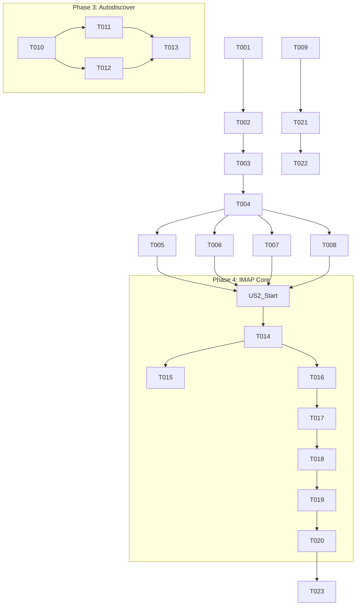

# Tasks: Standard Client Compliance

**Feature**: Standard Client Compliance (IMAP Core + Autodiscover)
**Specs**: [specs/007-standard-client-compliance/spec.md](specs/007-standard-client-compliance/spec.md)
**Plan**: [specs/007-standard-client-compliance/plan.md](specs/007-standard-client-compliance/plan.md)

## Phase 1: Setup
*Goal: Initialize data structures and database schema required for IMAP and Autodiscover.*

- [x] T001 Define `Mailbox` entity in `internal/core/domain/mailbox.go`
- [x] T002 Update `Message` entity with `UID`, `Mailbox`, `Flags` fields in `internal/core/domain/message.go`
- [x] T003 Update `EmailRepository` interface with Mailbox/UID methods in `internal/core/ports/repositories.go`
- [x] T004 Create SQLite migration `00X_add_imap_fields.sql` for new columns/tables in `internal/adapters/storage/sqlite/migrations/`

## Phase 2: Foundational
*Goal: Implement storage logic and core infrastructure blocking user stories.*

- [x] T005 Implement `GetMailbox`, `CreateMailbox` methods in `internal/adapters/storage/sqlite/email_repo.go`
- [x] T006 Implement `AssignUID` and UID sequence logic in `internal/adapters/storage/sqlite/email_repo.go`
- [x] T007 Implement `AddFlags`, `RemoveFlags`, `SetFlags` methods in `internal/adapters/storage/sqlite/email_repo.go`
- [x] T008 [P] Implement `FindByUIDRange` method in `internal/adapters/storage/sqlite/email_repo.go`
- [x] T009 Create `NotificationHub` for event broadcasting in `internal/core/notifications/hub.go`

## Phase 3: Instant Account Setup (Autodiscover)
*Goal: Enable email clients to automatically find server settings (User Story 1).*

- [x] T010 [P] [US1] Create Autodiscover response structs in `internal/adapters/http/dto/autodiscover.go`
- [x] T011 [US1] Implement Mozilla Autoconfig handler (`GET /.well-known/...`) in `internal/adapters/http/handlers/autodiscover.go`
- [x] T012 [US1] Implement Microsoft Autodiscover handler (`POST /autodiscover/...`) in `internal/adapters/http/handlers/autodiscover.go`
- [x] T013 [P] [US1] Register new routes in `internal/adapters/http/server.go`

## Phase 4: Basic Mailbox Usage (IMAP Core)
*Goal: Allow users to view folders and read emails via IMAP (User Story 2).*

- [x] T014 [US2] Update `Session` struct to track `SelectedMailbox` state in `internal/adapters/imap/session.go`
- [x] T015 [US2] Implement `LIST`, `CREATE`, `DELETE` command handlers in `internal/adapters/imap/commands.go`
- [x] T016 [US2] Implement `SELECT` command logic (returning UIDVALIDITY, EXISTS) in `internal/adapters/imap/commands.go`
- [x] T017 [US2] Implement `FETCH` command parser and response generator in `internal/adapters/imap/commands.go`
- [x] T018 [US2] Implement `UID` command dispatcher/wrapper in `internal/adapters/imap/commands.go`
- [x] T019 [US2] Implement `STORE` command for flag updates in `internal/adapters/imap/commands.go`
- [x] T020 [US2] Wire up all new commands in `handleCommand` dispatcher in `internal/adapters/imap/session.go`

## Phase 5: Instant Notifications (IMAP IDLE)
*Goal: Push new email notifications to connected clients (User Story 3).*

- [ ] T021 [US3] Implement `IDLE` command handler and event loop in `internal/adapters/imap/idle.go`
- [ ] T022 [US3] Integrate `NotificationHub` into IMAP Server/Session in `internal/adapters/imap/server.go`
- [ ] T023 [US3] Trigger notification events on new message ingestion in `internal/adapters/storage/sqlite/email_repo.go`

## Phase 6: Polish
*Goal: Documentation and final verification.*

- [ ] T024 Update `README.md` with DNS/Autodiscover configuration guide in `README.md`
- [ ] T025 Verify `TestIMAP_Compliance` suite passes (manual verification step)

## Dependencies

## Parallel Execution Strategy

1.  **Storage vs HTTP**: One developer can work on Phase 2 (Storage) while another works on Phase 3 (Autodiscover HTTP handlers) as they are largely independent until integration.
2.  **IMAP Commands**: Different IMAP commands (LIST, SELECT, STORE) can be implemented in parallel once the `Session` state update (T014) is complete.

## Implementation Strategy

We will adopt an **MVP-first approach**:
1.  **Autodiscover First**: It's a quick win that doesn't depend on complex storage changes, allowing us to verify client connectivity early.
2.  **Read-Only IMAP**: Implement `SELECT` and `FETCH` first to allow reading existing mails.
3.  **Refinement**: Add `STORE` (flags) and `UID` mapping logic.
4.  **Real-time**: Add `IDLE` last as it adds concurrency complexity.
